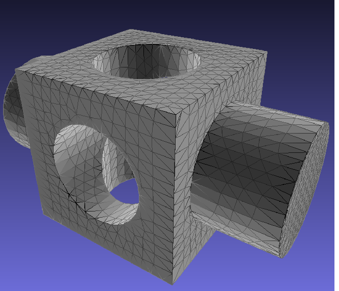
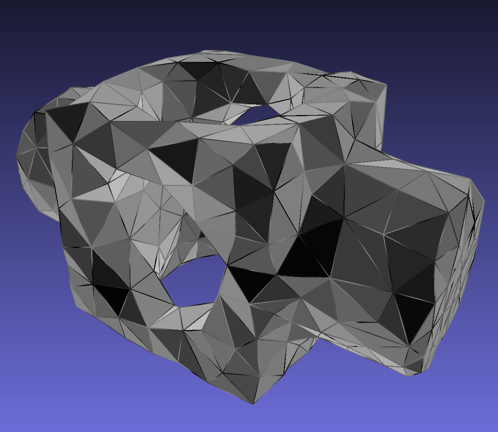
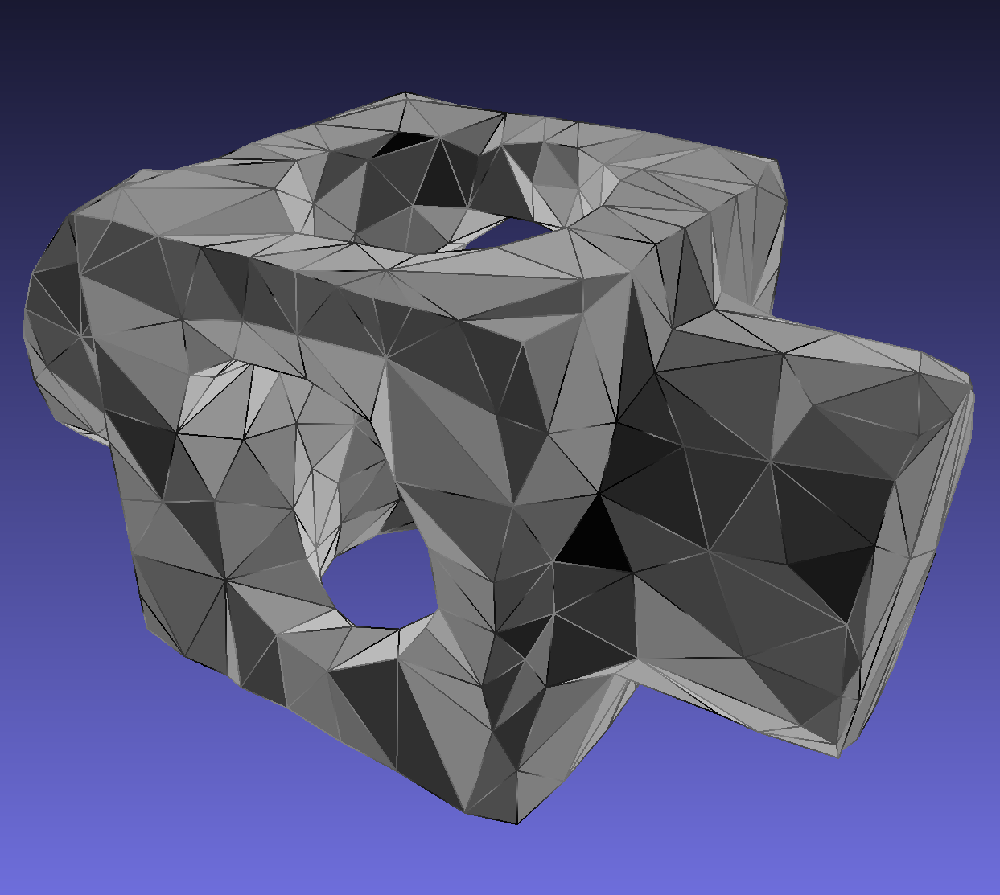
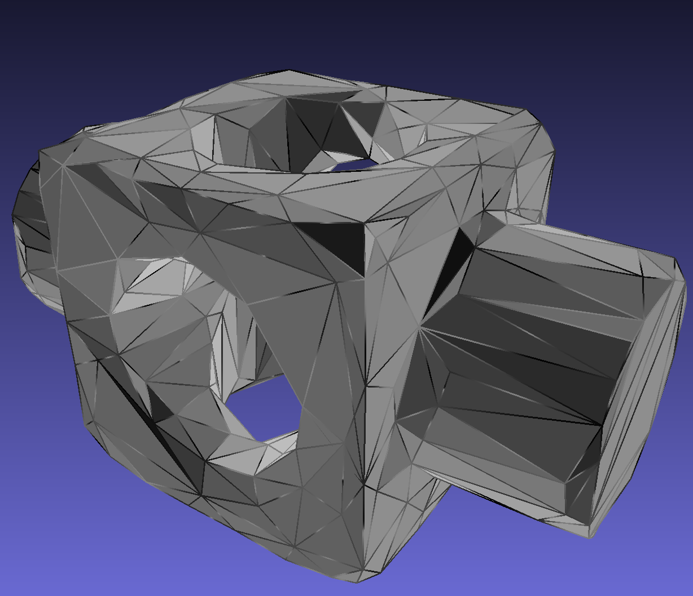
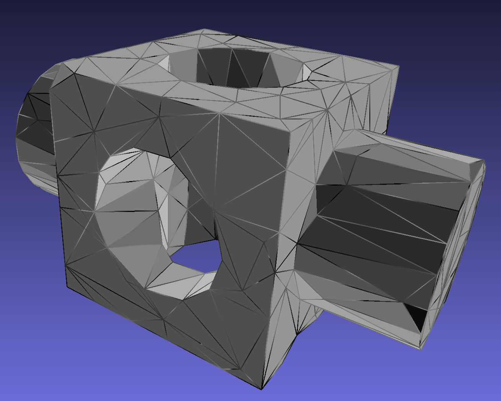
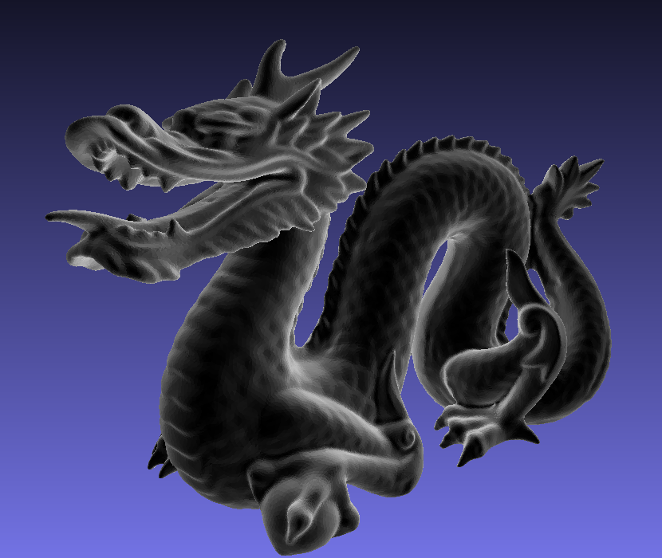
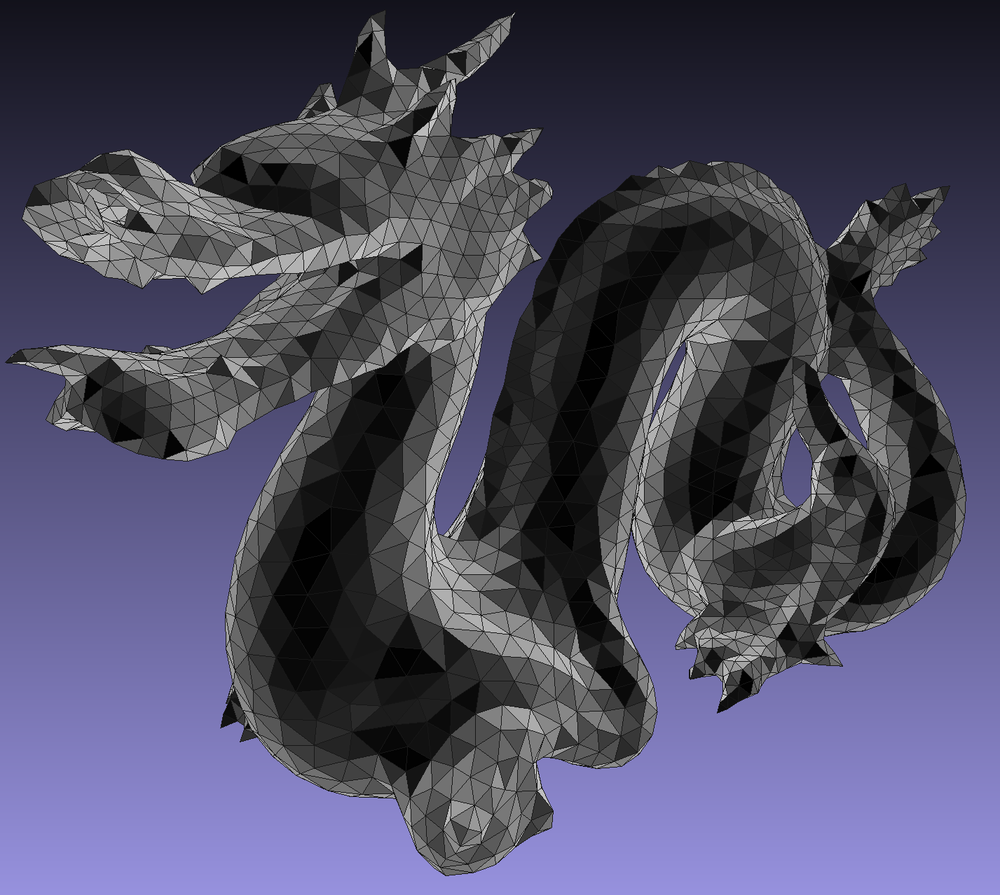
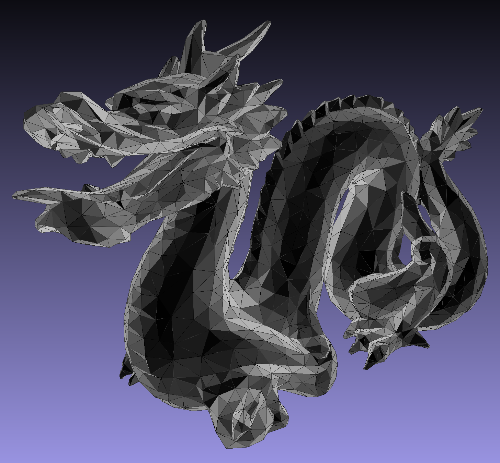

### Introduction

This tool takes a 3d mesh as input and compresses it into another 3d mesh such that the outputed mesh will use much less triangles while keeps the shape of the original mesh. The algorithm is based on metric-driven Discrete Voronoi Diagram construction. Some code is from other open source projects. This project is originally what I did for the (free-topic group) final project for CS184 at UC Berkeley, but I only open-sourced the part that I implemented in this repository, which includes `vertexClustering.cpp` (the implementation of metric-driven Voronoi Diagram based remeshing) and `VCFrontEnd.cpp` (a simply parser for parsing the command line arguments).

My implementation is mainly based on [1]. I implemented uniform remeshing, adaptive remeshing, anisotropic remeshing, and an optimal vertex placement policy based on the Quadric Error Metrics described in that paper. The main idea of this approach is to group the triangles of the input mesh into clusters, and the compute a representative vertex for each cluster, and finally connect these new vertices together to form a new mesh.

For more information, please checkout the "Remeshing" section in the original 
[final project report](https://184meshproj.weebly.com/).
(The link of reference [1] in the final report is broken, so please refer to the reference [1] in the section below if you need it.)

### Reference

[1] [Generic remeshing of 3D triangular meshes with
metric-dependent discrete Voronoi Diagrams](https://hal.archives-ouvertes.fr/hal-00537025/document)

[2] [Approximated Centroidal Voronoi Diagrams for Uniform Polygonal Mesh Coarsening](https://hal.archives-ouvertes.fr/hal-00534535/document)

[3] [Surface Simplification Using Quadric Error Metrics](https://www.cs.cmu.edu/~./garland/Papers/quadrics.pdf)

[4] [Recent Advances in Remeshing of Surfaces](http://www.cs.technion.ac.il/~gotsman/AmendedPubl/Pierre/remeshing_survey.pdf)

[5] [Anisotropy](https://www.iue.tuwien.ac.at/phd/wessner/node13.html)


### Build

```
mkdir build
cd build
cmake ..
make
```

### Run

```
./remesh.exe [options] <inputfile_name> 
```

Example
```
./remesh.exe -n 1000 -o3 models/dragon.obj
```

#### options

```
-n INT    : set the number of clusters, default 400
-f PATH   : set the name of the output file, a default name will be generated if not provided
-r INT    : set the radius of the ring used by adaptive sampling, default 2
-seed INT : set the seed for srand(), default time(0)
-q        : use quadric based placement policy for vertex position
-o1       : enable adaptive remeshing
-o2       : enable adaptive remeshing with anisotropic metric
-o3       : shortcut for -o2 -q
-v        : enable verification for the clusters
-h        : show this help page
```
### Some examples
The following visualization of meshes are generated by [MeshLab](https://www.meshlab.net/)
#### The original block model (block.obj)


#### Uniform remeshing


#### Adaptive remeshing


#### Adaptive remeshing with anisotrophic metric


#### Adaptive remeshing with anisotrophic metric + quadric based placement policy


#### The original dragon model (dragon.obj)



#### Uniform remeshing for the dragon model



#### Adaptive remeshing with anisotrophic metric + quadric based placement policy for the dragon model


